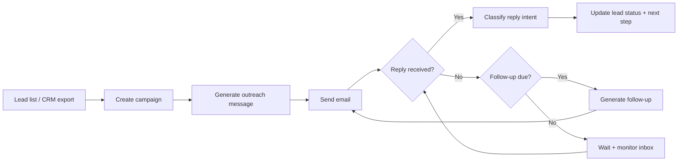

# Sales Automation Platform

Turn leads into meetings—without the manual follow-ups.

This project is a **sales automation platform** that helps teams:
- run structured outreach campaigns,
- automatically send smart follow-ups,
- track replies and outcomes,
- and keep everything visible in one dashboard.

## Who it’s for
- Founders and small sales teams who want consistency
- SDR/BD teams who need scale without losing personalization
- Ops teams who want “one system” for campaigns + follow-ups + reporting

## What it does (in plain English)
1. You upload/import leads and define a campaign.
2. The system generates and sends outreach emails.
3. It monitors replies (interested / not interested / out-of-office / ask later).
4. It automatically sends follow-ups when appropriate.
5. You see progress, replies, and next actions in the dashboard.

## Flow chart (high level)


## What makes it impressive
- **Consistent execution:** no missed follow-ups, no “forgot to reply”
- **Personalization at scale:** structured prompting + campaign controls
- **Visibility:** a dashboard that shows what’s happening right now
- **Workflow automation:** n8n orchestration for scheduling and triggers

## What’s inside (for builders)
- `frontend/`: Next.js dashboard (campaigns, leads, settings)
- `backend/`: API + agents interface
- `n8n-workflows/`: n8n workflow exports + notes
- `infra/`: deployment-related infrastructure
- `docs/`: implementation + deployment docs

## Quick start
```bash
make setup
make dev
```

## Docs
- Product overview: `docs/README.md`
- Frontend: `docs/06-FRONTEND.md`
- Deployment: `docs/07-DEPLOYMENT.md`

## Roadmap (short)
- Lead enrichment + deduping
- Better analytics (reply rates, time-to-reply, meeting conversion)
- Multi-channel sequences (email + LinkedIn)

## Screenshots / demo
If you want, I can add:
- a hero image,
- a couple dashboard screenshots,
- and a short GIF walkthrough (campaign → send → reply → follow-up).
