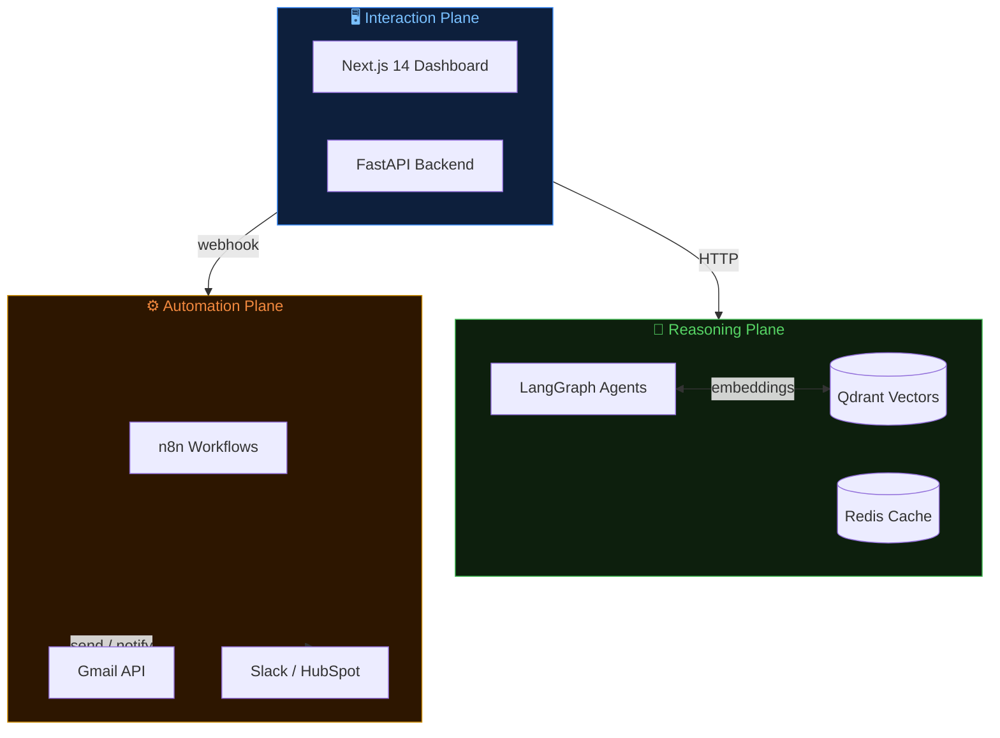

# ⚡ AI Sales Outreach Automation

**Hyper-personalized B2B outreach — researched, written, and sent by AI agents**


Upload a CSV of leads. AI agents research each company, write a personalized email referencing their actual news and strategy, send it via Gmail, classify replies, and schedule follow-ups — automatically.

---

## 😤 Cold outreach is broken

Generic _"Hi {FirstName}, I noticed you work at {Company}"_ emails get a **~1% reply rate**. Sales teams spend hours manually researching leads just to write emails that still feel templated.

The bottleneck isn't sending — it's the **research + personalization loop** that doesn't scale. Humans can't do deep company research at scale.

That's exactly what this platform automates.

---

## ✨ Let AI agents do the research

This platform ingests a list of leads, then runs a **LangGraph agent pipeline** for each lead: web research → company intelligence → hyper-personalized email → send via Gmail → reply classification → follow-up scheduling.

The product bet: **personalization quality beats volume**. One email that references a prospect's recent funding round, their job postings, or a pain point buried in their blog outperforms 100 generic blasts.

---

## 🔄 How It Works

Upload a CSV or connect Google Sheets. The platform processes each lead through a multi-agent pipeline — fully automated, rate-limited, and reply-aware.

```mermaid
flowchart LR
    A[📄 CSV / Sheets] --> B[⚙️ FastAPI]
    B -->|webhook| C[🔁 n8n Pipeline]
    C -->|per lead| D[🧠 Research Agent]
    D --> E[✍️ Personalization Agent]
    E --> F[📧 Gmail Send]
    F --> G[🔍 Reply Classifier]
    G --> H[📅 Follow-up Agent]

    style D fill:#1c2e1c,stroke:#3fb950,color:#56d364
    style E fill:#1c2e1c,stroke:#3fb950,color:#56d364
    style G fill:#1c2e1c,stroke:#3fb950,color:#56d364
    style H fill:#1c2e1c,stroke:#3fb950,color:#56d364
```



---

## 🏗 Three-Plane Architecture

Each layer has a single responsibility and can be replaced independently. Swap n8n for Temporal, or LangGraph for a custom DAG — neither leaks into the other.



| Plane          | Layer              | Responsibility                                                 |
| -------------- | ------------------ | -------------------------------------------------------------- |
| 🖥 Interaction | Next.js + FastAPI  | Human interface, auth, webhooks, data persistence              |
| 🧠 Reasoning   | LangGraph + Qdrant | Every LLM call — research, writing, classification             |
| ⚙️ Automation  | n8n                | Stateless orchestration — Gmail, Slack, CRM. No business logic |

---

## 🤖 The Agent Pipeline

Four LangGraph agents form the reasoning core. Each runs as an isolated graph with typed state, conditional edges, and structured JSON output.

| Agent                        | Phase | Responsibility                                                                                                     | Key Output                 |
| ---------------------------- | ----- | ------------------------------------------------------------------------------------------------------------------ | -------------------------- |
| 🧠 **Research Agent**        | 3A    | Scrapes company website, news, LinkedIn. Extracts funding signals, pain points, strategy.                          | `CompanyIntelligence` JSON |
| ✍️ **Personalization Agent** | 3B    | Generates hyper-personalized outreach using research + Qdrant template retrieval. Includes compliance check.       | Draft email + subject line |
| 🔍 **Reply Classifier**      | 3C    | Classifies inbound Gmail replies: `interested` / `not_interested` / `out_of_office` / `meeting_request`.           | Classification + CRM sync  |
| 📅 **Follow-up Agent**       | 3D    | Selects follow-up timing and tone based on prior thread. Conditional graph: `select_strategy → generate_followup`. | Follow-up email draft      |

> **81 tests passing** across all four agents as of Phase 3.

---

## 🛠 Built With

| Category           | Technologies                                                                     |
| ------------------ | -------------------------------------------------------------------------------- |
| **Frontend**       | Next.js 14 (App Router) · TypeScript · Tailwind CSS · shadcn/ui · TanStack Query |
| **Backend**        | FastAPI · Python 3.11 · SQLAlchemy 2.0 (async) · Alembic · Pydantic v2           |
| **Database**       | PostgreSQL 15 · Qdrant (vector search) · Redis (rate limits + queues)            |
| **AI / Agents**    | LangGraph · LangChain · Claude (Anthropic) · GPT-4 (OpenAI) · Tavily · Firecrawl |
| **Automation**     | n8n (self-hosted) · Gmail API (OAuth2) · HubSpot CRM · Slack                     |
| **Infrastructure** | Docker Compose · nginx reverse proxy · Makefile · Pytest + Jest                  |

---

## ⚡ Quickstart

**Prerequisites:** Docker, Docker Compose, API keys (see `.env.example`)

```bash
# Clone and configure
git clone https://github.com/BitMastermind/ai-sales-outreach.git
cd ai-sales-outreach
cp .env.example .env          # fill in your API keys

# Boot the full stack (PostgreSQL, Redis, Qdrant, n8n, FastAPI, Next.js)
make dev

# Seed demo campaign + leads
make seed
```

| Service             | URL                        |
| ------------------- | -------------------------- |
| Frontend Dashboard  | http://localhost:3000      |
| FastAPI (Swagger)   | http://localhost:8000/docs |
| n8n Workflow Editor | http://localhost:5678      |

> See `.env.example` for all required API keys: `OPENAI_API_KEY`, `ANTHROPIC_API_KEY`, `GMAIL_CLIENT_ID`, `TAVILY_API_KEY`, and more.

---

Built with [LangGraph](https://github.com/langchain-ai/langgraph) · [FastAPI](https://fastapi.tiangolo.com) · [n8n](https://n8n.io) · [Next.js](https://nextjs.org)
