# ⚡ AI Sales Outreach Automation

**Hyper-personalized B2B outreach — researched, written, and sent by AI agents**

Upload a CSV of leads. AI agents research each company, write a personalized email referencing their actual news and strategy, send it via Gmail, classify replies, and schedule follow-ups — automatically.

---

## 😤 Cold outreach is broken

Generic *"Hi {FirstName}, I noticed you work at {Company}"* emails get a **~1% reply rate**. Sales teams spend hours manually researching leads just to write emails that still feel templated.

The bottleneck isn't sending — it's the **research + personalization loop** that doesn't scale. Humans can't do deep company research at scale.

That's exactly what this platform automates.

---

## ✨ Let AI agents do the research

This platform ingests a list of leads, then runs a **LangGraph agent pipeline** for each lead: web research → company intelligence → hyper-personalized email → send via Gmail → reply classification → follow-up scheduling.

The product bet: **personalization quality beats volume**. One email that references a prospect's recent funding round, their job postings, or a pain point buried in their blog outperforms 100 generic blasts.

---

## 🔄 How It Works

Upload a CSV or connect Google Sheets. The platform processes each lead through a multi-agent pipeline — fully automated, rate-limited, and reply-aware.

```mermaid
flowchart LR
    A[📄 CSV / Sheets] --> B[⚙️ FastAPI]
    B -->|webhook| C[🔁 n8n Pipeline]
    C -->|per lead| D[🧠 Research Agent]
    D --> E[✍️ Personalization Agent]
    E --> F[📧 Gmail Send]
    F --> G[🔍 Reply Classifier]
    G --> H[📅 Follow-up Agent]

    style D fill:#1c2e1c,stroke:#3fb950,color:#56d364
    style E fill:#1c2e1c,stroke:#3fb950,color:#56d364
    style G fill:#1c2e1c,stroke:#3fb950,color:#56d364
    style H fill:#1c2e1c,stroke:#3fb950,color:#56d364
```

