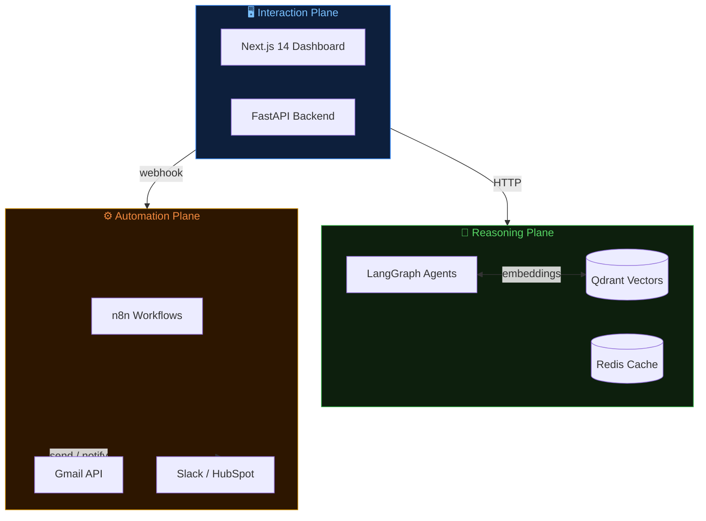

# README Implementation Plan

> **For agentic workers:** REQUIRED SUB-SKILL: Use superpowers:subagent-driven-development (recommended) or superpowers:executing-plans to implement this plan task-by-task. Steps use checkbox (`- [ ]`) syntax for tracking.

**Goal:** Write a single `README.md` at the repo root that reads like a startup pitch deck — bold, narrative-first, Mermaid diagrams, designed to impress technical and non-technical audiences.

**Architecture:** Pure Markdown file. No HTML. Mermaid fenced code blocks for all diagrams (renders natively on GitHub). Sections separated by `---`. Section labels as blockquotes above `##` headings.

**Tech Stack:** Markdown, Mermaid (flowchart LR / TB), shields.io badges.

**Spec:** `docs/superpowers/specs/2026-05-16-readme-design.md`

---

## File Map

| File | Action | Purpose |
|---|---|---|
| `README.md` | Overwrite | The full README — written in 8 tasks, one section per commit |

---

### Task 1: Hero Section

**Files:**
- Modify: `README.md`

- [ ] **Step 1: Write the hero section**

Replace the entire contents of `README.md` with:

```markdown
# ⚡ AI Sales Outreach Automation

**Hyper-personalized B2B outreach — researched, written, and sent by AI agents**


Upload a CSV of leads. AI agents research each company, write a personalized email referencing their actual news and strategy, send it via Gmail, classify replies, and schedule follow-ups — automatically.
```

- [ ] **Step 2: Verify the file was written**

Run: `head -20 README.md`
Expected: `<div align="center">` on line 1, hero content visible.

- [ ] **Step 3: Commit**

```bash
git add README.md
git commit -m "docs: readme hero — badges, tagline, one-liner"
```

---

### Task 2: The Problem + The Solution

**Files:**
- Modify: `README.md`

- [ ] **Step 1: Append the Problem and Solution sections**

```bash
cat >> README.md << 'MARKDOWN'

---

> **The Problem**

## 😤 Cold outreach is broken

Generic *"Hi {FirstName}, I noticed you work at {Company}"* emails get a **~1% reply rate**. Sales teams spend hours manually researching leads just to write emails that still feel templated.

The bottleneck isn't sending — it's the **research + personalization loop** that doesn't scale. Humans can't do deep company research for 500 leads a week.

---

> **The Solution**

## ✨ Let AI agents do the research

This platform ingests a list of leads, then spawns a **LangGraph agent pipeline** for each one: web research → company intelligence → hyper-personalized email → send via Gmail → reply classification → follow-up scheduling.

The product bet: **personalization quality beats volume**. One email that references a prospect's recent funding round, their job postings, or a pain point buried in their blog outperforms 100 generic blasts.
MARKDOWN
```

- [ ] **Step 2: Verify sections appended correctly**

Run: `grep -n "The Problem\|The Solution\|broken\|beats volume" README.md`
Expected: 4 matches with correct line numbers.

- [ ] **Step 3: Commit**

```bash
git add README.md
git commit -m "docs: readme problem/solution narrative"
```

---

### Task 3: How It Works — Mermaid End-to-End Flow

**Files:**
- Modify: `README.md`

- [ ] **Step 1: Append the How It Works section**

```bash
cat >> README.md << 'MARKDOWN'

---

> **End-to-End Flow**

## 🔄 How It Works

Upload a CSV or connect Google Sheets. The platform processes each lead through a multi-agent pipeline — fully automated, rate-limited, and reply-aware.

```mermaid
flowchart LR
    A[📄 CSV / Sheets] --> B[⚙️ FastAPI]
    B -->|webhook| C[🔁 n8n Pipeline]
    C -->|per lead| D[🧠 Research Agent]
    D --> E[✍️ Personalization Agent]
    E --> F[📧 Gmail Send]
    F --> G[🔍 Reply Classifier]
    G --> H[📅 Follow-up Agent]

    style D fill:#1c2e1c,stroke:#3fb950,color:#56d364
    style E fill:#1c2e1c,stroke:#3fb950,color:#56d364
    style G fill:#1c2e1c,stroke:#3fb950,color:#56d364
    style H fill:#1c2e1c,stroke:#3fb950,color:#56d364
```


MARKDOWN
```

- [ ] **Step 2: Verify Mermaid block is valid**

Run: `grep -c '```mermaid' README.md`
Expected: `1`

Run: `grep -A 15 'flowchart LR' README.md`
Expected: All 7 nodes and edge labels visible with no truncation.

- [ ] **Step 3: Commit**

```bash
git add README.md
git commit -m "docs: readme end-to-end flow mermaid diagram"
```

---

### Task 4: Three-Plane Architecture Diagram

**Files:**
- Modify: `README.md`

- [ ] **Step 1: Append the architecture section**

```bash
cat >> README.md << 'MARKDOWN'

---

> **System Architecture**

## 🏗 Three-Plane Architecture

Each layer has a single responsibility and can be replaced independently. Swap n8n for Temporal, or LangGraph for a custom DAG — neither leaks into the other.



| Plane | Layer | Responsibility |
|---|---|---|
| 🖥 Interaction | Next.js + FastAPI | Human interface, auth, webhooks, data persistence |
| 🧠 Reasoning | LangGraph + Qdrant | Every LLM call — research, writing, classification |
| ⚙️ Automation | n8n | Stateless orchestration — Gmail, Slack, CRM. No business logic |
MARKDOWN
```

- [ ] **Step 2: Verify diagram and table**

Run: `grep -c '```mermaid' README.md`
Expected: `2`

Run: `grep 'Interaction Plane\|Reasoning Plane\|Automation Plane' README.md | wc -l`
Expected: `3`

- [ ] **Step 3: Commit**

```bash
git add README.md
git commit -m "docs: readme three-plane architecture mermaid diagram"
```

---

### Task 5: LangGraph Agents Breakdown

**Files:**
- Modify: `README.md`

- [ ] **Step 1: Append the agents section**

```bash
cat >> README.md << 'MARKDOWN'

---

> **LangGraph Agents**

## 🤖 The Agent Pipeline

Four LangGraph agents form the reasoning core. Each runs as an isolated graph with typed state, conditional edges, and structured JSON output.

| Agent | Phase | Responsibility | Key Output |
|---|---|---|---|
| 🧠 **Research Agent** | 3A | Scrapes company website, news, LinkedIn. Extracts funding signals, pain points, strategy. | `CompanyIntelligence` JSON |
| ✍️ **Personalization Agent** | 3B | Generates hyper-personalized outreach using research + Qdrant template retrieval. Includes compliance check. | Draft email + subject line |
| 🔍 **Reply Classifier** | 3C | Classifies inbound Gmail replies: `interested` / `not_interested` / `out_of_office` / `meeting_request`. | Classification + CRM sync |
| 📅 **Follow-up Agent** | 3D | Selects follow-up timing and tone based on prior thread. Conditional graph: `select_strategy → generate_followup`. | Follow-up email draft |

> **81 tests passing** across all four agents as of Phase 3.
MARKDOWN
```

- [ ] **Step 2: Verify table rendered**

Run: `grep -c '| Agent |' README.md`
Expected: `1`

Run: `grep '3A\|3B\|3C\|3D' README.md | wc -l`
Expected: `4`

- [ ] **Step 3: Commit**

```bash
git add README.md
git commit -m "docs: readme langgraph agents breakdown table"
```

---

### Task 6: Tech Stack

**Files:**
- Modify: `README.md`

- [ ] **Step 1: Append the tech stack section**

```bash
cat >> README.md << 'MARKDOWN'

---

> **Tech Stack**

## 🛠 Built With

| Category | Technologies |
|---|---|
| **Frontend** | Next.js 14 (App Router) · TypeScript · Tailwind CSS · shadcn/ui · TanStack Query |
| **Backend** | FastAPI · Python 3.11 · SQLAlchemy 2.0 (async) · Alembic · Pydantic v2 |
| **Database** | PostgreSQL 15 · Qdrant (vector search) · Redis (rate limits + queues) |
| **AI / Agents** | LangGraph · LangChain · Claude (Anthropic) · GPT-4 (OpenAI) · Tavily · Firecrawl |
| **Automation** | n8n (self-hosted) · Gmail API (OAuth2) · HubSpot CRM · Slack |
| **Infrastructure** | Docker Compose · nginx reverse proxy · Makefile · Pytest + Jest |
MARKDOWN
```

- [ ] **Step 2: Verify table**

Run: `grep -c '| \*\*' README.md`
Expected: `6` (one row per category)

- [ ] **Step 3: Commit**

```bash
git add README.md
git commit -m "docs: readme tech stack table"
```

---

### Task 7: Project Phases (Build Status)

**Files:**
- Modify: `README.md`

- [ ] **Step 1: Append the phases section**

```bash
cat >> README.md << 'MARKDOWN'

---

> **Build Status**

## 📊 Project Phases

| Phase | Status | Description |
|---|---|---|
| 0 — Scaffold | ✅ Complete | Monorepo, Docker Compose, Makefile, CI structure |
| 1 — Data Layer | ✅ Complete | PostgreSQL schema, Qdrant collections, Alembic migrations |
| 2 — FastAPI Backend | ✅ Complete | REST API, Gmail OAuth, GmailService, all endpoints |
| 3 — LangGraph Agents | ✅ Complete | Research, Personalization, Reply Classifier, Follow-up · **81 tests** |
| 4 — n8n Workflows | ⬜ Next | Pipeline launcher, reply monitor, follow-up scheduler |
| 5 — Frontend | ⬜ Planned | Next.js dashboard, campaign UI, lead management |
| 6 — Integration Tests | ⬜ Planned | End-to-end with real Postgres test container |
| 7 — Deployment | ⬜ Planned | Production Docker Compose, nginx, env hardening |
MARKDOWN
```

- [ ] **Step 2: Verify table**

Run: `grep -c '✅ Complete\|⬜' README.md`
Expected: `8` (4 complete + 4 planned)

- [ ] **Step 3: Commit**

```bash
git add README.md
git commit -m "docs: readme phase tracker"
```

---

### Task 8: Quickstart + Final Polish

**Files:**
- Modify: `README.md`

- [ ] **Step 1: Append the quickstart section**

```bash
cat >> README.md << 'MARKDOWN'

---

> **Get Started**

## ⚡ Quickstart

**Prerequisites:** Docker, Docker Compose, API keys (see `.env.example`)

```bash
# Clone and configure  (replace <your-github-username> and <repo-name> with actuals)
git clone https://github.com/<your-github-username>/<repo-name>.git
cd <repo-name>
cp .env.example .env          # fill in your API keys

# Boot the full stack (PostgreSQL, Redis, Qdrant, n8n, FastAPI, Next.js)
make dev

# Seed demo campaign + leads
make seed
```

| Service | URL |
|---|---|
| Frontend Dashboard | http://localhost:3000 |
| FastAPI (Swagger) | http://localhost:8000/docs |
| n8n Workflow Editor | http://localhost:5678 |

> See `.env.example` for all required API keys: `OPENAI_API_KEY`, `ANTHROPIC_API_KEY`, `GMAIL_CLIENT_ID`, `TAVILY_API_KEY`, and more.

---

Built with [LangGraph](https://github.com/langchain-ai/langgraph) · [FastAPI](https://fastapi.tiangolo.com) · [n8n](https://n8n.io) · [Next.js](https://nextjs.org)
MARKDOWN
```

- [ ] **Step 2: Verify final structure — all 8 sections present**

Run:
```bash
grep -n "^## " README.md
```
Expected output (8 headings):
```
## 😤 Cold outreach is broken
## ✨ Let AI agents do the research
## 🔄 How It Works
## 🏗 Three-Plane Architecture
## 🤖 The Agent Pipeline
## 🛠 Built With
## 📊 Project Phases
## ⚡ Quickstart
```

- [ ] **Step 3: Verify Mermaid block count**

Run: `grep -c '```mermaid' README.md`
Expected: `2`

- [ ] **Step 4: Verify no broken heredoc markers leaked into the file**

Run: `grep -c 'MARKDOWN\|EOF\|HEREDOC' README.md`
Expected: `0`

- [ ] **Step 5: Final commit**

```bash
git add README.md
git commit -m "docs: readme quickstart + footer — complete"
```

---

## Verification

After all 8 tasks:

```bash
# Full section count
grep -c "^## " README.md
# Expected: 8

# Mermaid diagrams
grep -c '```mermaid' README.md
# Expected: 2

# Badges in hero
grep -c 'img.shields.io' README.md
# Expected: 8

# No leaked heredoc artifacts
grep -c 'MARKDOWN\|^EOF$' README.md
# Expected: 0
```

Open `README.md` in the GitHub web UI (or a Markdown preview) to confirm Mermaid diagrams render as vector graphics.
